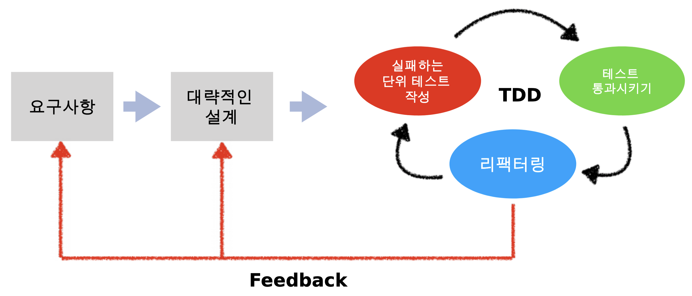

# TDD (Test Driven Development)

테스트 주도 개발

실패하는 테스트 코드를 먼저 작성함으로써 테스트가 개발을 주도하게 되는 개발 방법론

## 실패하는 테스트 케이스
- 요구사항을 명확히 이해한다.
- 작성할 코드의 스펙을 정의한다.
- 작성할 객체의 의존성을 고려한다.
- 외부에 노출할 인터페이스를 고려한다.

- 요구사항을 이해한다.
- 대략적인 설계를 한다. (인터페이스)
- 실패하는 테스트 케이스를 만든다.
- 테스트를 성공한다.
- 리팩토링을 진행한다.
