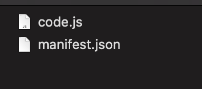

## Figma Plugin Setting 방법

1. Figma Plugin을 세팅하기 위해서는 Figma Desktop App이 필요하다.  
[다운로드 링크](https://www.figma.com/downloads/)
2. Figma App에서 Plugins > Development > New Plugin 을 클릭한다.  

3. Create를 하면 두 가지 핵심 코드를 확인할 수 있다.

4. 기본적으로 이미 생성이 되어 import가 되지만, 다른 plugin을 추가하려면 Plugins > Development > Import plugin from manifest를 클릭하여 작성된 manifest 파일을 넣는다.

## manifest file
manifest file이 figma plugin을 만들 수 있는 핵심 파일이다.<ㅠ>
하나의 UI 파일과, 하나의 core 파일을 등록하여 figma 안에서 동작하게 만들 수 있다.

이 plugin 중 가장 핵심은 `main`과 `ui` 부분이다.

### main
main은 Figma에서 제공하는 API를 연결할 수 있는 코드다.  
Figma에서는 기본적으로 `code.js` 파일이라는 이름으로 사용하게 권장하고 있다.  
post message 형식의 API를 받아서 처리할 수 있게 도와준다.  
단, main에 해당하는 파일은 ui와 직접적으로 연결되지 않아, 로컬에서는 확인이 어렵다.  
피그마 앱에 등록하여 테스트를 해야한다.

### UI
UI는 pigma에서 plugin으로 불러올 때 화면에 보여지는 부분이다.  
사용자에게 어떤 UI로 제공할 지에 대해서 처리하는 곳이며, code.js의 API에 대한 호출 부분이 들어가게 된다.  
유의해야 할 점은 manifest에 등록할 수 있는 파일은 .html 확장자를 가지는 파일 하나 뿐이다.  
즉, code를 분리하여 import하는 형식으로 만들었을 경우 정상적으로 동작하지 않는다. 번들러를 통해 `하나의 파일`로 만들 필요가 있다.

