# 깃허브 가이드라인

## 깃허브 소개
깃허브(GitHub) : 분산 버전 관리 툴인 깃(Git)을 사용하는 프로젝트를 지원하는 웹 호스팅 서비스  
**오픈 소스 코드 저장소**이며 많은 오픈 소스들이 깃허브를 통해 관리되고 잇다.

## 깃 소개
깃(Git) : 분산 버전 관리 툴.  
이게 뭐라고 쓸까?

예를 들어 보자..

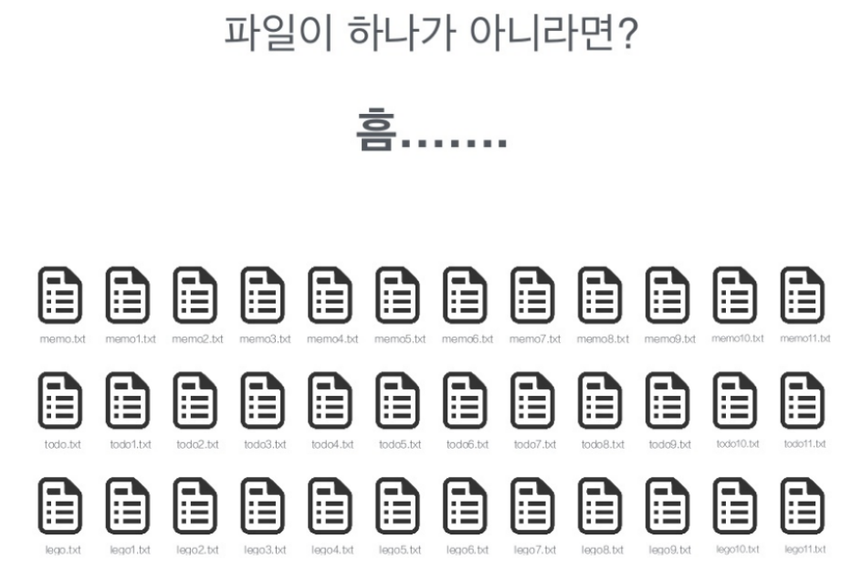

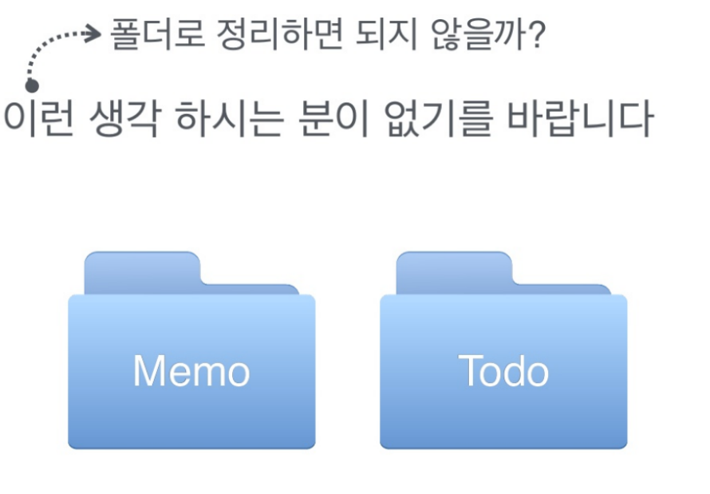

기존 이렇게 관리를 하면서 불편함을 못느꼈다면... 

###**깃 쓰지 마러.. 인정!**

## 깃을 쓰게 되면?

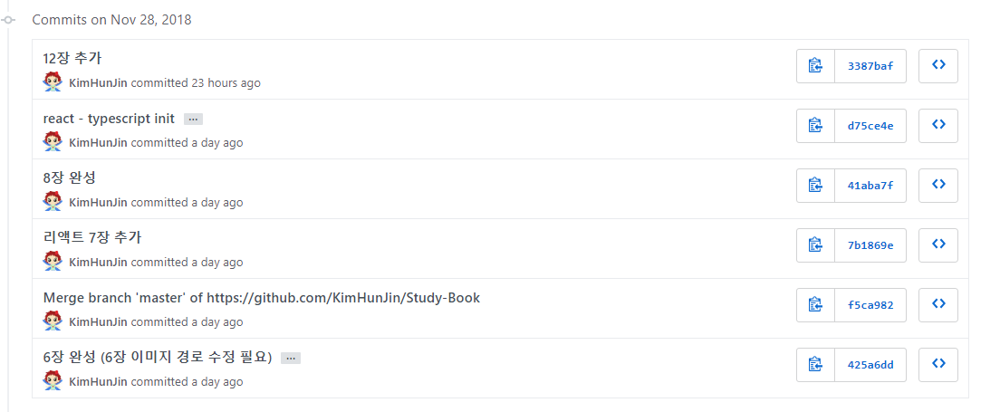

변경 사항에 대해 확인이 가능해진다.

\ㅇ/ : 그렇다면 어떻게 쓸까?

[깃허브 설치](https://git-scm.com/)

자 설치를 시작하자.

* 윈도우
    
    1. 클릭  
    2. 아싸리 Next 누르기  
    3. 설치 완료
   
* 맥
    1. terminal 실행
    2. git --version 입력
    3. 설치하라는 문구가 나오면 YES
    4. 기다리면 끝
    
    
## 깃 가지고 놀기

주로 사용하게 될 명령어는 크게 4가지다.

1. git commit
    * 코드의 변경 사항을 저장한다.
2. git push
    * 로컬 저장소에 저장된 변경 내용을 깃허브 혹은 깃 서버로 전송한다.
3. git pull
    * 깃허브 혹은 깃 서버에 있는 내용을 로컬 저장소로 이동한다.
4. git checkout name
    * 브랜치를 이동한다.
    
글로 적어봣자 들어오지도 않는다.

### 깃 허브 계정 만들기

우선 깃허브 게정부터 만들자.

[깃허브](https://github.com) 이 링크로 들어가서 가입

1. 깃허브 게정을 만들었으면, 저장소를 만든다.

    * 이런 창이나

    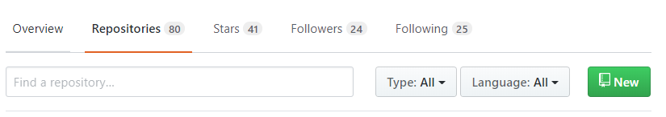

    * 이런 창이 보이면 NEW 클릭
    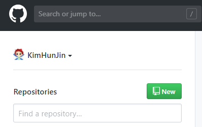

    * 이름을 입력하고 생성
    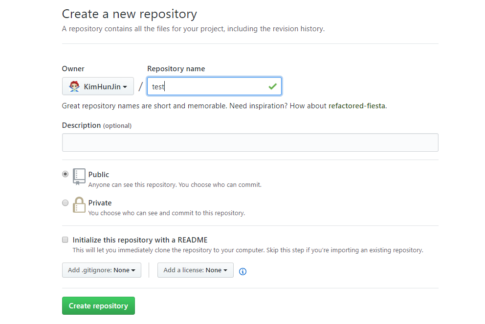
    
    * 이런 창이 나오고, 보이는 경로 복사
    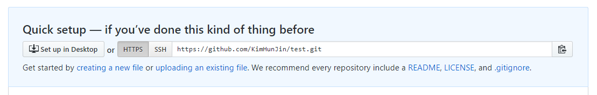
   
2. git bash 실행
    > window 유저라면 git bash 실행  
    맥 유저라면 terminal 실행
    
    1. 폴더 생성 (바탕화면에 만들었다.)
    2. 폴더로 이동
    3. 명령어 입력 (git clone "복사한 URL")
        
    4. 폴더 이동 (폴더가 하나 생겼을 거다.)
        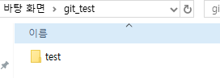
    5. 텍스트 파일 생성
        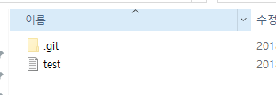
    6. 명령어 입력 (git add *)
    7. 명령어 입력 (git commit -m "메시지")
        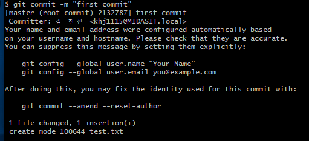
    8. 명령어 입력 git config --global user.name "깃허브 가입할 때 사용한 이름"
    9. 명령어 입력 git config --global user.email "깃허브 가입할 때 사용한 이메일"
    10. 명령어 입력 git push
        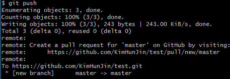
    11. 확인
        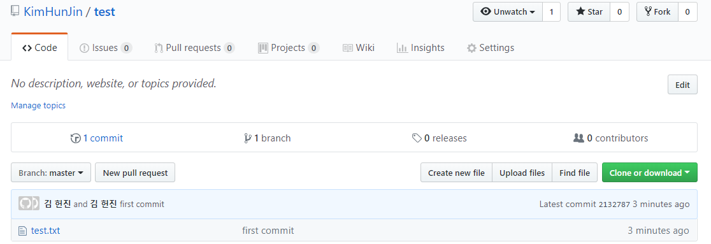
        
이렇게 끝