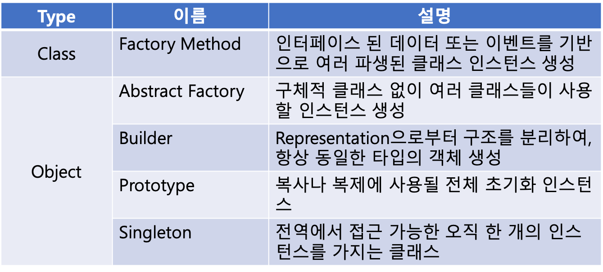
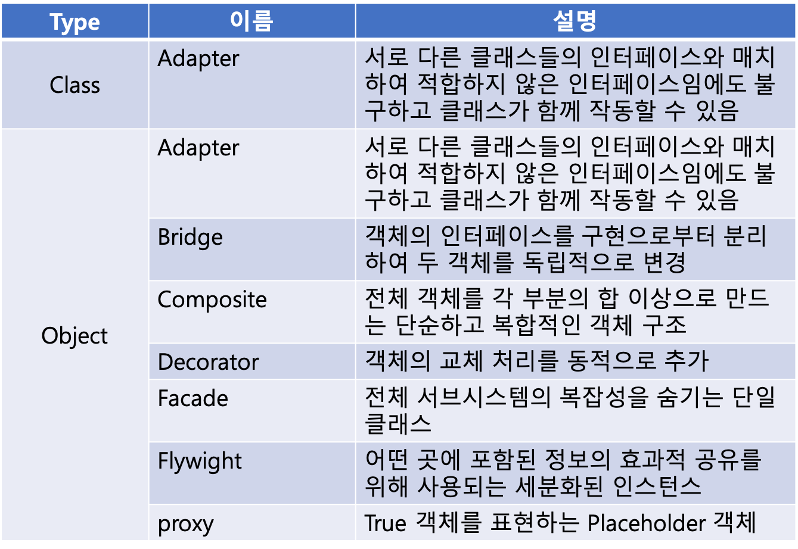
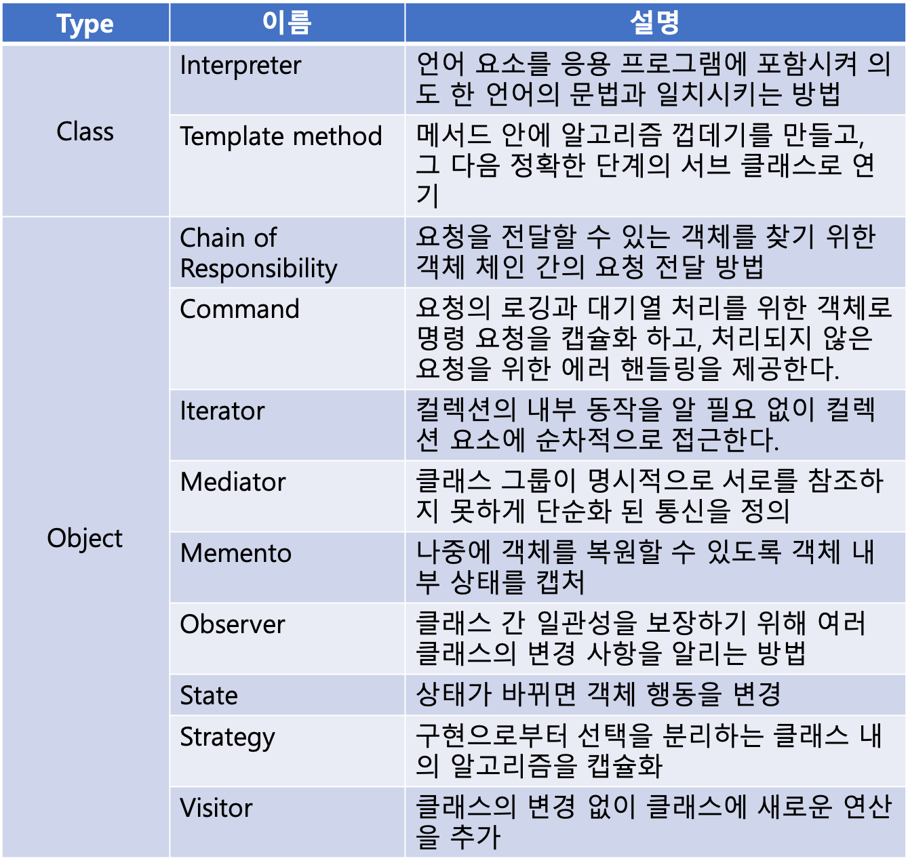

# 자바스크립트 디자인 패턴

> A design pattern is a term used in software engineering for a general reusable solution to a commonly occurring problem in software design.
> 소프트웨어 설계에서 일반적으로 발생하는 문제에 대한 일반적인 재사용 가능한 솔루션을 위해 소프트웨어 엔지니어링에서 사용되는 용어

자바스크립트 패턴은 크게 3가지로 나뉜다. (이는 자바스크립트 뿐만 아니라 다른 언어에도 적용 된다.)

## Creational Patterns
> 객체 생성에 기초된 패턴

## Structural Patterns
> 클래스나 객체를 조합해 더 큰 구조를 만드는 패턴

## Behavior Pattern
> 객체가 실행되고 함께 작동하는 방식의 패턴

