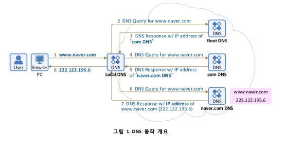
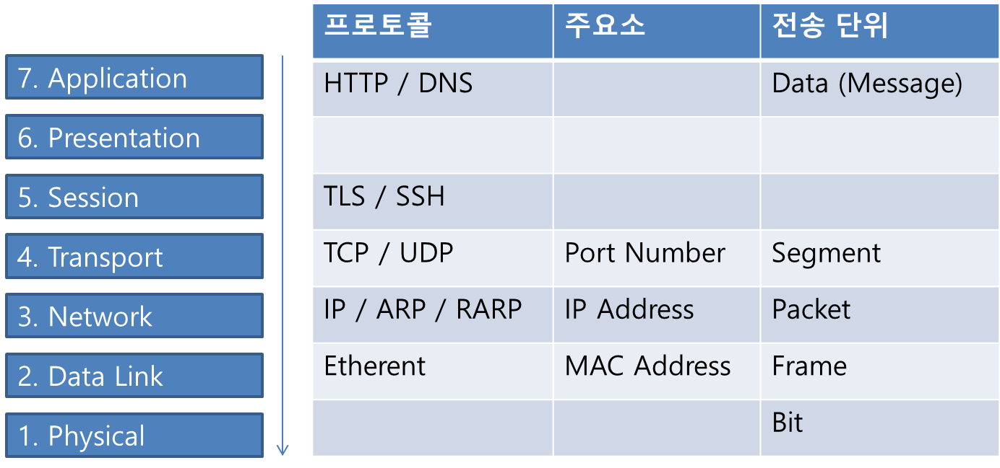

## HTTP/0.9
* 초기 HTTP 버전.

## HTTP/1.0
* 1996년 5월 정식 공개
* RFC1945 사양 발행

## HTTP/1.1
* 1997년 1월 공개
* RFC2068 사양 발행 --> 현재 RFC2616 버전

## DNS 구성 요소
1. 도메인 네임 스페이스 (Domain Name Space)
2. 네임 서버 (Name Server)
3. 리졸버 (Resolver)



### 네임 서버 (Name Server)
```
도메인 네임 스페이스의 트리구조에 대한 정보를 가짐
```

### 리졸버
```
DNS 클라이언트의 요청을 네임 서버로 전달하고
네임 서버로부터 정보를 클라이언트에게 제공하는 기능
```

### 도메인 네임 스페이스
```
DNS가 저장/관리하는 계층적 구조
```


## Client To Server Connection
1. URL 입력
2. URL로 IP 획득
	* Local DNS 서버
		
		
		
		
	* Root DNS 서버
	* 1차 DNS 서버 (Top Level DNS)
	* 2차 DNS 서버 (Authorative DNS)
	* ...
3. 획득한 IP로 HTTP 웹서버로 HTTP 메시지 작성
4. ARP를 활용해 수신측 MAC 주소 획득
	* OSI 7 Layer 중 3계층
		
		
		
		


## [www.naver.com](http://www.naver.com) 쳤을 때 일어나는 일렬의 과정을 설명하세요.

www.naver.com을 주소에 쳤을 때, ip를 찾아 접근하고, 데이터를 가져와 화면에 보여지는 과정에 대해 알아본다.

모든 과정은 osi 7 layer을 기반으로 이뤄진다.


[https://velog.io/@devzunky/TIL-no.89-Network-The-7-Layers-of-the-OSI-Model](https://velog.io/@devzunky/TIL-no.89-Network-The-7-Layers-of-the-OSI-Model)


[https://shlee0882.tistory.com/110](https://shlee0882.tistory.com/110)

[ 요약 ]

1. URL에 www.naver.com을 입력한다.
2. 도메인 서버로부터 IP를 건내받는다.
3. SSL을 통해 암호화를 진행한다.
4. 연결 방식을 정한다. (TCP)
5. 클라이언트에서 IP를 탐색하여 TCP 연결을 시도한다.
6. TCP 연결이 성공적으로 완료되면, 필요한 정보를 요청한다.
7. 요청 받은 정보를 사용자 화면에 보여준다.

우선 URL에 www.naver.com을 입력했을 때 www.naver.com에 해당하는 IP를 받아와야 한다.
IP를 받아오는 곳을 DNS (Domain Name Service)라고 하며, DNS Server로부터 해당하는 URL의 IP를 찾아서 제공한다.

DNS는 OSI 7 Layer의 7계층 (application layer)에 있다.

### DNS (Domain Name Service)

- 참고 ([https://itsandtravels.blogspot.com/2018/11/dnsdomain-name-system-dns.html](https://itsandtravels.blogspot.com/2018/11/dnsdomain-name-system-dns.html))


[https://ddooooki.tistory.com/31](https://ddooooki.tistory.com/31)

1. 우선 PC에 저장된 Local DNS에서 캐시된 IP가 있는지를 확인한다.
    1. if( cached ) return IP
2. 로컬 DNS에 존재하지 않는 IP라면 Root DNS에서 IP를 검색한다.
    1. root DNS에서 확인할 수 있는 정보는 .com에 대한 내용이며, Local DNS에 .com에 해당하는 DNS로 재검색을 하라고 알려준다.
3. 로컬 DNS에서 IP를 확인하지 못했기 때문에 2레벨 DNS에서 검색한다. 이때 .com을 알고 있어 .com에 해당하는 DNS에서 검색한다.
    1. naver.com을 확인했으나, IP를 발견하지 못했다. 다시 Local DNS에 기재하고 IP를 찾는 과정을 반복한다.
4. 발견하지 못했기 때문에 3레벨 DNS로 이동한다. 여기서 www.naver.com이라는 풀네임을 발견하고, 그 IP를 리턴한다.

---

다시 www.naver.com을 검색하게 되면, 1~4번까지의 과정을 거치지 않고, 로컬 DNS에 캐시된 IP주소를 가져온다.

IP 주소를 알아냈으니, 연결 방법을 선택한다.

대표적으로 TCP와 UDP가 있다.

HTTP 프로토콜을 이용하였기에 TCP 방식으로 연결을 결정한다.

TCP or UDP
참고 ([https://upcount.tistory.com/103](https://upcount.tistory.com/103))

IP 주소도 알고, 연결 방법도 결정했으니, 그 IP주소를 바탕으로 연결을 진행한다.

연결을 하기 위해서는 IP주소의 mac address를 알아야 한다.

이 mac address를 탐색해 가는 과정에 사용되는 프로토콜이 ARP이다.

ARP가 IP주소를 기반으로 mac address를 얻어오기 위해 boradcast 방법을 사용한다.


같은 대역 (router)에 IP주소를 던져서 일치하는 IP주소를 확인하여, 그 IP가 mac address를 반환하도록 하는 방법이다.

같은 대역에 없으면, 한 단계 위로, 그 위에도 없으면 게이트웨이를 타고 그 위로 올라가 IP를 탐색한다.


참고 : https://brownbears.tistory.com/195

MAC 주소도 알았으니, 드디어 클라이언트가 www.naver.com에 연결을 할 수 있게됐다.

1계층인 물리계층을 타고 서버 (naver)의 물리계층으로 접근한다.

2계층인 데이터링크의 스위치를 통해 연결을 한다.

3계층인 네트워크계층의 IP로 접근한다.

4계층인 전송계층에서 TCP 연결을 시도한다.

이때 처음 연결을 진행하기 때문에, TCP에서 3way-handshaking 방식을 이용한다.


HTTP 1.1부터 매번 연결을 진행하지 않고, 연결해 둔 상태를 유지한다.

이 상태를 유지하며 데이터를 주고 받을 준비를 한다.

연결된 상태에서 데이터를 주고 받을 때

5계층인 세션 계층에서 연결 상태를 유지하고, 양단의 에러를 체크하여 복구를 진행하기도 한다.

HTTP연결을 진행했지만, 서버에서는 프록시를 통해 HTTPS 연결로 자동으로 변경한다. (리다이렉트 : 서버의 설정으로 가능)

(프록시는 전체 도메인을 작성하지 않더라도, 해당 도메인으로 이동할 수 있게 해준다. ex, naver.com)

HTTPS연결을 위해 6계층에 있는 SSL(Security Socket Layer)에서 인증키를 요구하고, 암호화 및 독호화를 진행한다.

HTTPS연결이 되었기 때문에, 네트워크 7계층 어플리케이션계층을 방어하기 위한 웹방화벽이 추가된다.

웹 방화벽
참고 링크 : [https://realforce111.tistory.com/61](https://realforce111.tistory.com/61)

하트블리드 취약점 알아볼것.

드디어, 신뢰성 있는 연결이 완료되었다.

Client와 서버 (naver)는 연결된 통로로 데이터를 주고 받다가, 연결이 종료될 때 마지막으로 4way-handshaking을 시도하고 종료한다.


---

### 추가 되야 할 부분

- 서버 - DB 통신
- 클라이언트 Dom 객체 그리는 과정
- 클라이언트 - 서버 API 콜 과정