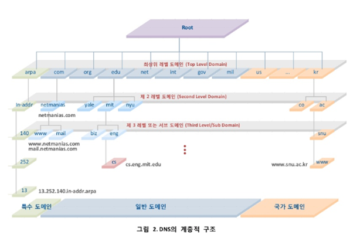
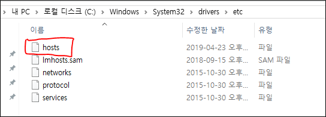
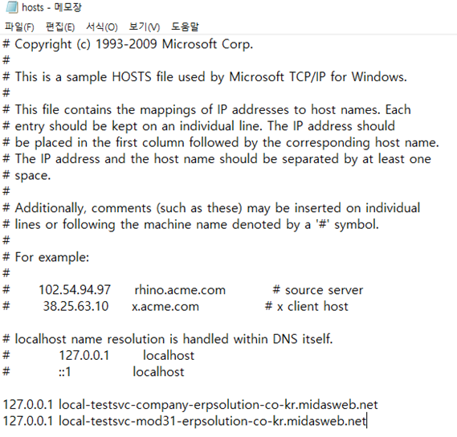

## HTTP/0.9
* 초기 HTTP 버전.

## HTTP/1.0
* 1996년 5월 정식 공개
* RFC1945 사양 발행

## HTTP/1.1
* 1997년 1월 공개
* RFC2068 사양 발행 --> 현재 RFC2616 버전

## DNS 구성 요소
1. 도메인 네임 스페이스 (Domain Name Space)
2. 네임 서버 (Name Server)
3. 리졸버 (Resolver)


### 네임 서버 (Name Server)
```
도메인 네임 스페이스의 트리구조에 대한 정보를 가짐
```

### 리졸버
```
DNS 클라이언트의 요청을 네임 서버로 전달하고
네임 서버로부터 정보를 클라이언트에게 제공하는 기능
```

### 도메인 네임 스페이스
```
DNS가 저장/관리하는 계층적 구조
```



## Client To Server Connection
1. URL 입력
2. URL로 IP 획득
	* Local DNS 서버
		
		
		
		
	* Root DNS 서버
	* 1차 DNS 서버 (Top Level DNS)
	* 2차 DNS 서버 (Authorative DNS)
	* ...
3. 획득한 IP로 HTTP 웹서버로 HTTP 메시지 작성
4. ARP를 활용해 수신측 MAC 주소 획득
	* OSI 7 Layer 중 3계층
		
		
		
		
    
   