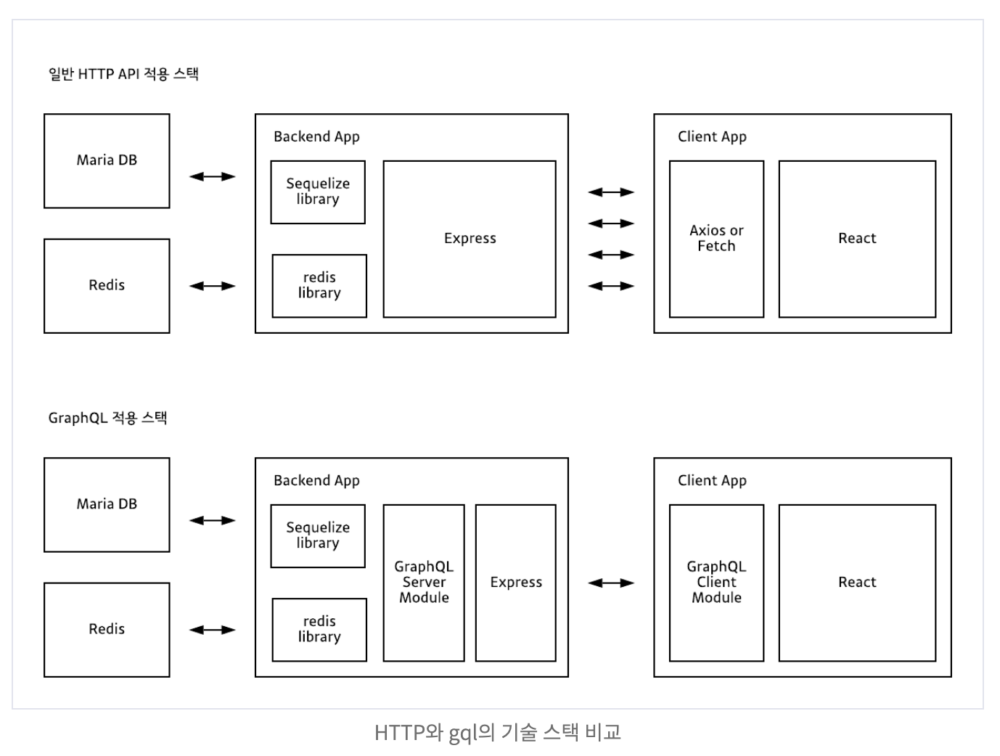

## GraphQL 
- Graph Query Language
- 페이스북에서 만든 쿼리 언어
- 웹 클라이언트가 데이터를 서버로부터 효율적으로 가져오는 것이 목적

ex)
```
{
  hero {
    name
    friends {
      name
    }
  }
}
```
- 언어나 플랫폼에 독립적
- 네트워크에도 독립적
- 하나의 End Point

### Rest API와 비교

- Rest API는 여러개의 End Point가 존재하며, 각 포인트마다 쿼리가 다름
- gql을 사용하면 여러 번의 쿼리 이용이 불필요함

;


## 참고
- [카카오 테크](https://tech.kakao.com/2019/08/01/graphql-basic/)
- https://www.holaxprogramming.com/2018/01/20/graphql-vs-restful-api/


## 코드
- [코드](https://github.com/KimHunJin/playground/tree/master/apollo-graphql)
